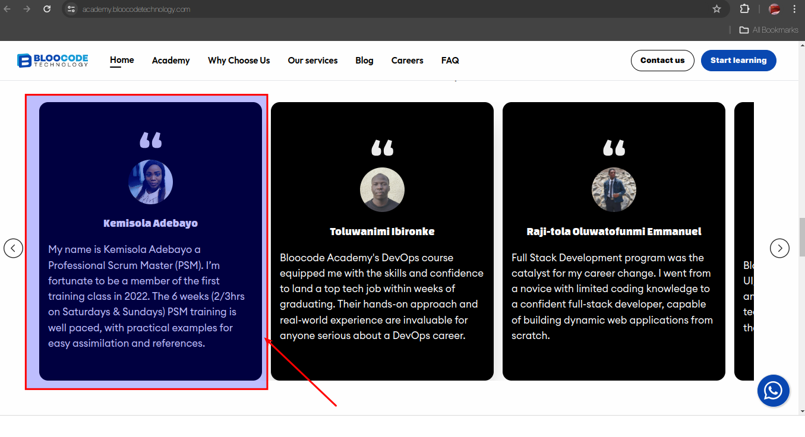

## Technical Assement for Frontend Developer Intership (Unpaid)

<p>
This repository contains the code for the Bloocode Technology Frontend Developer Technical Assessment. 
<p>

### Project Description

<p>
This project is a responsive web page that displays a list of products fetched from a JSON endpoint. The application allows users to filter and sort products based on various criteria. 
</p>

### Features

- Fetches product data from https://dummyjson.com/products using (replace with your chosen method - Fetch API or Axios)
- Displays a list of products with essential details (replace with details displayed)
- Implements filtering functionality based on (category)
- Offers sorting options.
- Utilized material ui for responsive design

### Getting Started

1. Clone the repository:

```bash
git clone git@github.com:cboychinedu/bloocodetechnicaltest.git

```

2. Install dependencies:

```bash
npm install .
```

3. Run the development server

```bash
npm start
```

- This will start the development server and open the application in your browser.

### Part B: Bloocode Academy Website Evaluation

The Bloocode Academy website (https://academy.bloocodetechnology.com/) was evaluated, and the follwing image explains where the fault is.


